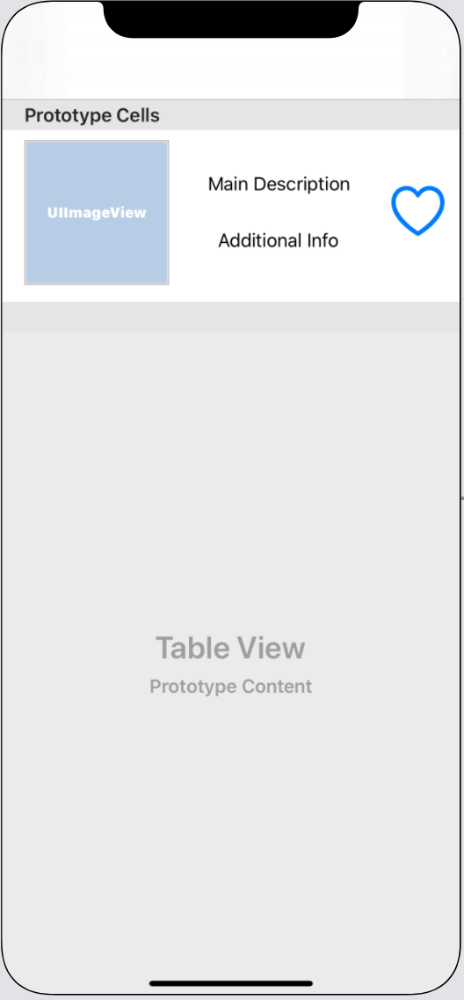

# Pursuit-Core-iOS-Comprehensive-Technical-Assessment

## Project Outline

For this assessment, build a Firebase-backed project with the following functionality:

- Users can create accounts and sign in
- When creating an account, a user can choose which API they want to use: event tickets or art search
- After signing-in or creating an account, the user is presented with a screen that displays a list of information from their selected API
- Each cell should have a heart icon that the user can tap to favorite the item
- If the item has already been favorited, the heart should load as filled in, and tapping it should unfavorite the cell
- Tapping on a cell should segue to a detail screen displaying more information about the item
- There should also be a screen that shows only the favorited items.  Tapping the heart icon should unfavorite it and remove it from the favorites list

For building your UI, you must build at least one View Controller using a Storyboard file, and at least one View Controller purely programmatically.

## Frameworks

- Use Firebase Auth to manage account creation and signing in
- Use Firebase Firestore to manage which items have been favorited

## APIs

You must allow a user to select from at least 2 APIs when building their account:

| Name | Table View | Detail View |
|---|---|---|
| Ticket master | Use their [discovery API](https://developer.ticketmaster.com/products-and-docs/apis/discovery-api/v2/) to load all events at a location that the user searches for.  Include an image, the name of the event, and the time the event starts | In addition to the info from the Table View, display the price ranges and a link to the event.
| Rijksmuseum | Use their [Collection API](https://data.rijksmuseum.nl/object-metadata/api/) to load all museum items from a name that the user searches for.  Include an image and the title of the item. | Use the [Collection Details API](https://data.rijksmuseum.nl/object-metadata/api/) to load additional information about the select item including its plaque Description in English, its date it was created, and the place it was produced.

## Rubric

# UI

## Login Screen

- Enter an email address
- Enter a password
- Sign-in to an existing account

## Create Account Screen

- Select which API you want to pull from
- Create a new account

## List Items Screen

- Display a list of data from an API
- Entering text in the search bar searches for and displays relevant data
- Have a favorite button in each cell
- Tapping the favorite button should fill the UI and make a call to favorite in the backend
- Selecting a cell should segue to a detail View Controller that displays additional information

## Item Detail Screen

- Show additional information about the selected item

## Favorite Items Screen

- Display a list of on the Things that have been favorited by the user.  Each cell should contain a favorite button which the user can tap to unfavorite the Thing

